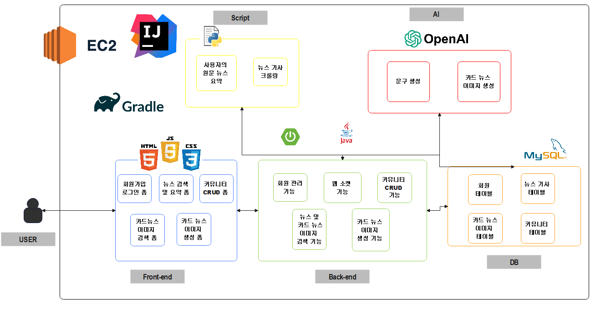
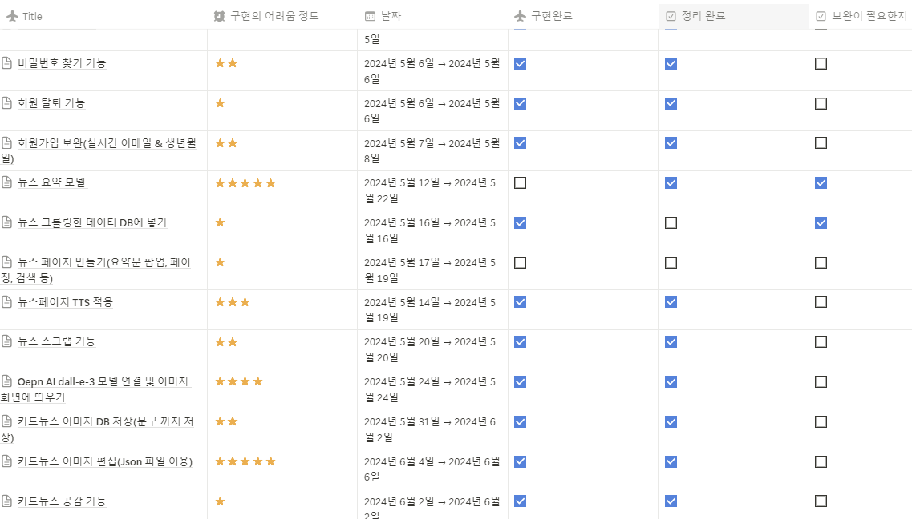
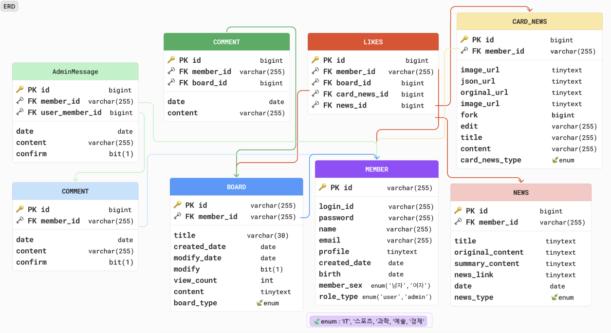

[](https://github.com/chltmdgh522/AutoMakeCardNews/actions/workflows/deploy.yml)


# 📰 AutoMakeCardNews
##### 🏆 캡스톤디자인 및 졸업 프로젝트 작품: 생성형 AI를 활용한 카드뉴스 자동 제작 서비스

### 📜 Contents
 1. [Overview](#-overview)
 2. [서비스 화면](#-서비스-화면)
 3. [주요 기능](#-기능)
 4. [개발 환경](#%EF%B8%8F-개발-환경)
 5. [시스템 아키텍처](#-시스템-아키텍처)
 6. [기술 특이점](#-기술-특이점)
 7. [기획 및 설계 산출물](#-기획-및-설계-산출물)
 8. [Conventions](#-conventions)
 9. [팀원 소개](#-팀원-소개)
 
## ✨ Overview
##### 🏆 개발 기간: 24.03 ~ 24.09 현재는 코드 리펙토링 중!
- 현대 사회에서 정보의 전달 속도와 방식은 매우 중요한 요소로 자리 잡았으며, 특히, 소셜 미디어와 인터넷 플랫폼의 발달로 시각적 콘텐츠의 수요가 급증하고 있다.
- 이러한 환경 속에 카드뉴스는 간결하고 직관적인 정보 전달 방식으로 인기를 얻고 있으나, 고품질의 카드뉴스 제작은 시간과 노력이 많이 소요되는 작업이다.
- 따라서 본 프로젝트에서는 생성형 AI를 활용하여 자동으로 카드뉴스를 제작하는 시스템을 개발하였다.
- 본 애플리케이션은 사용자의 텍스트를 기반으로 음성(TTS)이 포함된 카드뉴스를 생성할 수 있을뿐더러 생성된 이미지를 바탕으로 편집을 할 수 있다.
- 또한 뉴스 요약 모델을 개발하여 사용자가 원하는 뉴스 요약 정보를 쉽게 얻을 수 있다. 이 외에도, 취업 및 다양한 카테고리에서 정보를 공유하는 커뮤니티 서비스 등을 개발하였다.

## ✨ AMCN의 배포 사이트
##### 🏆 [사이트](https://amcn.kr/)


## ✨ AMCN의 소통 플랫폼 
##### 🏆 [노션](https://www.notion.so/ae9aab2290414d5ebc4510c922177e54)
##### 🏆 [디스코드]


## 👀 서비스 화면
### ✨ `모바일(아이폰 12 Pro 기준 max-width:480px)` 지원X

### 📹 [시연 영상](https://youtu.be/1NWfusum-3o)

### 📄 [PPT](https://drive.google.com/file/d/1-0nLBGCaFirQsS9YzaNkT_HMynD6glDW/view?usp=drive_link)

### 📑 [논문](https://drive.google.com/file/d/1XiMoU2AU1xXNuAgsvO861APGpdFjQyOQ/view?usp=drive_link)

  
## ✨  기능 

- `회원 관리`
	- 회원가입, 로그인, 비밀번호 찾기, 비밀번호 변경, 이메일 변경, 아이디 찾기 등의 기능을 제공하여 사용자의 계정을 효율적으로 관리합니다.
	- Spring Security와 세션을 사용하여 구현했습니다.
	- 마이페이지에서는 회원 탈퇴 및 프로필 사진을 변경할 수 있는 기능을 제공했습니다.

- `이메일 인증`
    - 회원가입 시 이메일로 비밀번호가 전송되며, 사용자는 해당 비밀번호를 입력하여 회원가입을 완료할 수 있습니다.
	- 이메일 전송은 **JavaMailSender**를 사용하여 처리되며, 마이페이지에서 이메일을 변경할 때도 동일한 방식으로 인증을 요구합니다. 인증을 완료하지 않으면 서비스 이용이 제한됩니다.


- `소셜 로그인`
	- OAuth 2.0을 사용하여 네이버, 카카오 소셜 로그인을 구현했습니다.
	- 소셜 로그인 시 사용자의 이메일 정보를 확인하고, 중복된 이메일이 있을 경우 중복 알림을 제공하여 계정 혼동을 방지합니다.
	- 기존 회원과 소셜 로그인 회원을 동일하게 관리하기 위해 DB에 소셜 로그인 필드를 추가하고, 로그인 처리 로직을 커스터마이징했습니다.


- `커뮤니티 관리 및 Quill API 도입`
	- 게시글과 댓글의 CRUD(Create, Read, Update, Delete) 구현했습니다. 또한 AJAX를 활용한 공감을 자유롭게 표시할 수 있습니다.
	- 글 작성 시 Quill API를 도입하여 사용자가 다양한 텍스트 스타일을 적용할 수 있는 WYSIWYG 에디터 기능을 제공했습니다. 이를 통해 텍스트의 포맷팅, 이미지 삽입, 하이퍼링크 추가 등이 가능합니다.


- `게임 기능`
	- 벽돌깨기, 숫자 맞추기, 숫자 야구게임 등 3가지 JS 기반의 간단한 게임을 제공합니다.
	- 사용자는 게임을 통해 포인트를 얻을 수 있으며, 재미 요소입니다.
	

- `뉴스 기사 크롤링`
	- Selenium을 사용하여 뉴스 기사 원문을 크롤링하는 기능을 구현했습니다.
	- 크롤링한 데이터는 뉴스 요약 문구에 분석에 활용됩니다.


- `뉴스 요약 모델`
	- KoBART(한국어 BART) 사전 학습 모델을 기반으로 뉴스 기사를 요약하는 기능을 구현했습니다.
	- 초기 모델의 정확도는 67%였으며, 수집한 데이터로 추가 학습을 진행하여 75%까지 성능을 향상했습니다.
	- GPU를 활용해 훈련 시간을 단축했습니다.


- `DALL-E 모델 연동`
	- OpenAI의 DALL-E 모델을 연동하여 사용자가 입력한 카드뉴스의 내용을 바탕으로 관련 이미지를 실시간으로 생성하는 기능을 구현했습니다.
	- 이미지 생성 요청은 Ajax를 통해 비동기로 처리되며, 생성된 이미지는 서버에 저장된 후 즉시 사용자에게 제공됩니다.
	- 또한 OpenAI API를 활용해 입력된 문구에 따라 AI가 10개의 문구를 생성하며, 사용자는 이를 선택해 이미지에 추가할 수 있습니다.

- `프롬프트 개선`
	- DALLE 모델에서의 프롬프트 구성 방식과 텍스트 구조가 이미지 생성에 미치는 영향을 분석한 결과, 카드뉴스 형식에 적합한 키워드와 구조적인 텍스트를 도출했습니다. 이를 바탕으로 괄호 사용과 공백 처리를 세심하게 다듬어 카드뉴스 형식의 이미지를를 얻었습니다.

   
- `카드뉴스 이미지 편집`
	- 사용자가 생성된 이미지를 기반으로 필터, 텍스트 추가, 펜, 도형 삽입 등의 기능을 제공하여 이미지 편집을 할 수 있습니다.
	- 위치 이동 및 색상 변경 기능을 제공하여 사용자 맞춤형 디자인이 가능합니다.


- `카드뉴스 JSON 편집`
	- 카드뉴스의 각 요소(이미지, 텍스트, 도형 등)는 JSON 형식으로 저장되며, 이를 통해 게시된 카드뉴스를 다시 불러와 자유롭게 편집할 수 있습니다.
	- 사용자는 이전 작업 내용을 그대로 이어서 수정할 수 있습니다.


- `동영상 다운로드`
	- 카드뉴스 이미지와 문구를 결합해 동영상 파일로 다운로드할 수 있는 기능을 제공합니다.
	- TTS(Text-to-Speech) 기능을 활용해 문구를 음성으로 변환하여 동영상에 음성을 추가했으며, gTTS 라이브러리를 사용했습니다.
	- FFmpeg를 사용해 이미지와 오디오를 결합하여 동영상 파일을 생성하고, 사용자는 이를 로컬로 저장할 수 있습니다.


- `카드뉴스 포크 기능`
	- 다른 사용자가 만든 카드뉴스를 포크하여 재편집할 수 있는 기능을 구현했습니다.
	- 포크 시 원본 카드뉴스의 출처가 자동으로 표시되며, 사용자는 이를 기반으로 새로운 디자인을 제작할 수 있습니다.


- `카드뉴스 템플릿`
	- DALL-E 모델로 생성된 이미지를 다른 사용자들이 템플릿으로 활용할 수 있도록 템플릿 리스트에 진열하였습니다.
	- 사용자는 템플릿을 선택하여 카드뉴스 제작 시 활용할 수 있으며, 템플릿 데이터는 서버에서 관리됩니다.


- `카드뉴스 휴지통`
	- 카드뉴스를 삭제하면 휴지통으로 이동하며, 휴지통에서 복구하거나 영구 삭제할 수 있는 기능을 제공합니다.
	- 삭제된 데이터는 30일 동안 유지되며, 서버 측에서 정기적으로 영구 삭제된 데이터를 처리하는 배치 작업이 실행됩니다.
   

- `@Async`
	- OpenAI API 요청이 동시에 2개 들어오는 상황에서 이를 처리하기 위해 @Async를 사용해 비동기 처리로 대응했습니다.
    - 프롬프트에서 불필요한 내용을 제거하여 요청의 효율을 높였습니다.
    - 그 결과 70초에서 약 35초로 API 응답 시간이 줄어들었습니다. 
   

- `웹소켓 적용`
	- 관리자와 사용자 간 실시간 소통을 위한 웹소켓(WebSocket) 기반의 채팅 기능을 구현했습니다.
	- 사용자는 관리자와만 1:1 대화를 할 수 있으며, 관리자는 여러 사용자와 동시 대화를 관리할 수 있습니다.
	- STOMP 프로토콜을 사용해 메시지를 주고받으며, Spring WebSocket을 통해 실시간 통신을 처리합니다.


- `관리자 계정 기능`
	- 관리자는 회원 관리, 게시물 관리, 댓글 관리, 문의 채팅 기능을 통해 전체 서비스를 운영할 수 있습니다.
	- 관리자 계정은 일반 사용자와 구분됩니다.


- `AWS EC2 서버 배포 및 CI/CD 구축축`
	- AWS EC2 프리티어를 사용하여 서버를 배포하였으며
    - 도메인은 가비아에서 구입한 후 Route 53을 사용해 EC2 인스턴스와 연결했습니다. 
    - SSL 인증서를 갱신하여 HTTPS 통신을 적용했습니다.
    - GitHub Actions를 활용해 CI/CD 파이프라인을 구축하였습니다. 코드 푸시 시 자동으로 빌드 및 테스트를 실행하도록 설정했습니다. 성공적인 테스트 후 EC2 서버로 자동 배포되도록 워크플로우를 구성하여 배포 프로세스를 효율화했습니다.


## 🖥️ 개발 환경
**Management Tool**
- 형상 관리 : Git
- 커뮤니케이션 : Discord, Notion
- 디자인 : Figma

**🐳 Backend**
- Java `21`
- Python `3.11.0`
- Spring Framework `3.2.4`
- pipenv or poetry 
- Swagger `2.6.0`
- Thymeleaf
- Jpa

**🤖 AI**
- OpenAI
- KoBart 
  

**🦊 Frontend**
-  HTML5, CSS3, JAVASCRIPT


**🗝️ API**
- [Web Speech API](https://developer.mozilla.org/en-US/docs/Web/API/Web_Speech_API)
- [Quill_API](https://quilljs.com/docs/api/)
- OpenAI API
   

**🗂️ DB**
- MySQL `8.0.30`

**🌐 Server**
- AWS EC2 (Ubuntu `20.04`)
- Nginx `1.23` (Reverse Proxy)
- HTTPS (TLS `1.2`)

**🔨 IDE**
- IntellJ `2023.2`

**🖼️ Gradle**
```
implementation 'org.springframework.boot:spring-boot-starter-data-jdbc'
	implementation 'org.springframework.boot:spring-boot-starter-data-jpa'
	implementation 'org.springframework.boot:spring-boot-starter-security'
	implementation 'org.springframework.boot:spring-boot-starter-thymeleaf'
	implementation 'org.springframework.boot:spring-boot-starter-validation'
	implementation 'org.springframework.boot:spring-boot-starter-web'
	implementation 'org.mybatis.spring.boot:mybatis-spring-boot-starter:3.0.3'
	implementation 'org.springframework.session:spring-session-core'
	implementation 'org.thymeleaf.extras:thymeleaf-extras-springsecurity6'
	implementation 'org.springframework.boot:spring-boot-starter-mail:3.2.5'
	implementation 'org.springframework.boot:spring-boot-starter-json'
	implementation 'org.python:jython-standalone:2.7.2'
	implementation 'com.googlecode.json-simple:json-simple:1.1.1'
	implementation 'io.jsonwebtoken:jjwt-api:0.11.5'
	runtimeOnly 'io.jsonwebtoken:jjwt-impl:0.11.5'
	runtimeOnly 'io.jsonwebtoken:jjwt-jackson:0.11.5'
	implementation 'com.theokanning.openai-gpt3-java:client:0.10.0'
	implementation 'com.theokanning.openai-gpt3-java:service:0.10.0'
	implementation 'com.stripe:stripe-java:23.2.0'
	implementation 'javax.xml.bind:jaxb-api:2.3.1'
	implementation 'sh.platform:config:2.2.2'
	implementation 'commons-io:commons-io:2.11.0'
	implementation 'com.madgag:animated-gif-lib:1.4'
	implementation 'io.github.cdimascio:java-dotenv:5.2.2'
	implementation 'io.github.cdimascio:dotenv-java:2.2.0'
	implementation 'org.springframework.boot:spring-boot-starter-oauth2-client'
	implementation 'org.json:json:20211205'
	implementation 'org.springframework.boot:spring-boot-starter-websocket'
	implementation 'org.springdoc:springdoc-openapi-starter-webmvc-ui:2.6.0'
```

**🖼️ requirements.txt**
```
charset-normalizer 3.3.2
click              8.1.7
colorama           0.4.6
comtypes           1.4.5
decorator          4.4.2
filelock           3.15.4
fsspec             2024.6.1
gTTS               2.5.2
huggingface-hub    0.24.0
idna               3.7
imageio            2.35.1
imageio-ffmpeg     0.5.1
intel-openmp       2021.4.0
Jinja2             3.1.4
MarkupSafe         2.1.5
mkl                2021.4.0
moviepy            1.0.3
mpmath             1.3.0
networkx           3.3
numpy              1.26.4
packaging          24.1
pillow             10.4.0
pip                23.2.1
playsound          1.3.0
proglog            0.1.10
pypiwin32          223
pyttsx3            2.90
pywin32            306
safetensors        0.4.3
setuptools         68.2.0
sympy              1.13.1
tbb                2021.13.0
tokenizers         0.19.1
torch              2.3.1
tqdm               4.66.4
transformers       4.42.4
typing_extensions  4.12.2
urllib3            2.2.2
wheel              0.41.2

```


## 💫 시스템 아키텍처


## ✨ 기술 특이점
- DALL-E와 GPT-4o 모델을 활용하여 이미지와 문구가 결합된 카드뉴스를 제작했으며, 생성된 카드뉴스는 이미지, 문구 위치, 색상, 편집 요소 등으로 구성된 JSON 파일과 함께 서버에 저장됩니다. 이를 통해 카드뉴스를 다시 편집할 때 각 요소를 자유롭게 수정할 수 있는 유연성을 제공합니다.
- 카드뉴스 형식에 적합한 이미지를 생성하기 위해, 프롬프트에 카드뉴스에 알맞은 키워드와 구조적인 텍스트를 포함하고 괄호 사용 및 공백 처리를 세심히 조정하여 원하는 결과물을 얻었습니다.
- KoBART 모델의 성능을 기존 66%에서 80%로 향상시켰습니다. 이를 위해 AI 허브에서 데이터를 수집하고 에포크를 10회로 설정해 훈련을 진행했으며, Rouge 점수를 활용해 원본 모델과 훈련된 모델의 정확도를 비교하여 성능 개선을 확인했습니다.
- 소셜 로그인, 실시간 채팅 등 웹에서 가능한 대부분의 기능을 구현했습니다.
- 기존 카드뉴스 생성 시간이 약 70초로 오래 걸렸던 문제를 해결하기 위해, 이미지 생성과 문구 생성을 비동기 방식(@Async)으로 처리하도록 개선했습니다. 이를 통해 생성 시간을 약 30~40초로 단축하며 성능을 크게 향상했습니다.

# 📂 기획 및 설계 산출물

### [💭 요구사항 정의 및 기능 명세](https://www.notion.so/ae9aab2290414d5ebc4510c922177e54)




### [✨ ER Diagram](https://www.figma.com/board/1Uc4vVCBi55xHwkM7iCesv/ANCM?node-id=0-1&node-type=canvas&t=Yf9wU45PPNKY6ovN-0)



# 💞 팀원 소개
##### ❤️‍🔥 AMCN을 개발한 팀원들을 소개합니다!
추가할예정!!! 
아래는 다른 프로젝트 팀원들입니당

|                       **[김성학](https://github.com/hak0622)**                         | **[최승호](https://github.com/chltmdgh522)**    | 
|:-------------------------------------------------------------------------------------------------------:|:-------------------------------------:| 
|  | |   |  
|                                          Leader & Frontend & AI                                          |                Backend & AI                | 

## 😃 팀원 역할

- **김성학**
  - 팀장, 기획, 크롤링, 디자인 설계 및 프론트 개발, 프롬프트 개선

- **최승호**
  - ERD 구축, (카드뉴스, 커뮤니티, 회원, 뉴스) API 개발, OpenAI API 연동, 서버 배포 및 최적화, 뉴스 요약 모델 성능 향상, 웹 소켓 채팅, 프롬프트 개선 
